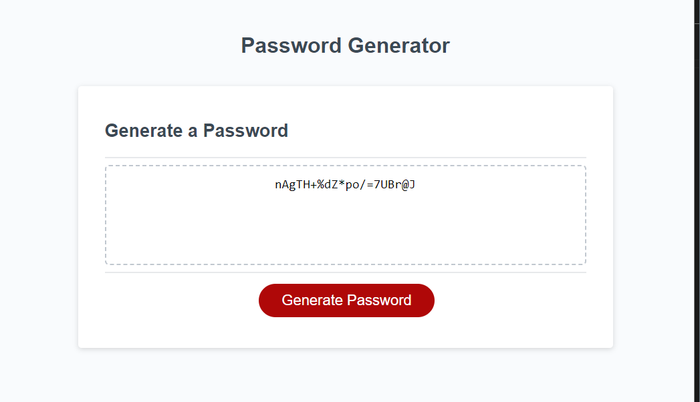

# password generator

## Modify JavaScript Code

The purpose of this project was to practice writing code in JavaScript that allows a user to interact with a webpage to generate a randomized password of their specified length and including user specified character sets.
I learned and practiced using prompt() and confirm() windows to collect user input, writing if statements that resulted in concatenated arrays, writing a for loop that selected random characters from an array and pushed them into a new array, and displaying an array as a string without commas using the innerHTML element. Using descriptive comments to describe the purpose and function of the code was an important factor in keeping track of each step.

## Installation

N/A

## Usage

View the webpage and click the "Generate Password" button to enter user parameters for the password to be generated. After indicated the desired length and character sets, you will see a randomly generated password displayed in the text area.

View the webpage here: https://sarah-jensen.github.io/password-generator/

## Credits

Starter code provided by UC Berkeley Extension. 

## License

Refer to the LICENSE in the repo.

---
